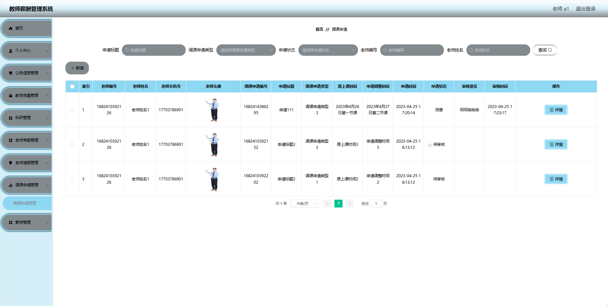

基于Springboot的教师薪酬管理系统（程序+论文）
=
### 完整代码获取地址：从戎源码网 ([https://armycodes.com/](https://armycodes.com/))
### 作者微信：19941326836  QQ：952045282 
### 承接计算机毕业设计、Java毕业设计、Python毕业设计、深度学习、机器学习
### 选题+开题报告+任务书+程序定制+安装调试+论文+答辩ppt 一条龙服务
### 所有选题地址https://github.com/nature924/allProject

一、项目介绍
---
基于Spring Boot框架实现的教师薪酬管理系统，系统包含两种角色：管理员、教师主要功能如下。

### 【教师功能】

1. **首页：** 查看系统的最新消息。
2. **个人中心：**
   - **修改密码：** 更改登录密码。
   - **个人信息：** 查看和编辑个人基本信息。
3. **公告信息管理：** 查看学校发布的通知和公告。
4. **教学质量管理：**
   - 查看学生评价：查看学生对教学的评价和反馈。
   - 提交教学计划：上传并管理本学期的教学计划。
5. **科研管理：**
   - 查看科研项目：查看自己参与的科研项目信息。
6. **老师考勤管理：**
   - 查看考勤记录：查看个人的考勤记录。
   - 请假申请：提出请假申请，包括事假、病假等。
   - 调课申请：提出调课的申请。
7. **薪资管理：**查看薪资详情：查看个人的薪资明细。
  

### 【管理员功能】

1. **首页：** 查看系统的概况和重要提醒。
2. **个人中心：**
   - **修改密码：** 修改管理员账户的登录密码。
   - **个人信息：** 查看和编辑管理员的基本信息。
3. **管理员管理：** 对系统中的管理员账户进行管理。
4. **基础数据管理：**
   - **公告类型管理：** 管理系统中发布公告的分类，如通知、紧急通告等。
   - **科研类型管理：** 管理科研项目的分类，方便统计和管理。
   - **请假类型管理：** 维护请假申请的分类，如事假、病假等。
   - **调课申请类型管理：** 维护调课申请的分类，方便分类处理。
5. **公告信息管理：** 发布、编辑和删除学校的通知和公告。
6. **教学质量管理：** 查看和管理教学质量。
7. **科研管理：** 管理科研项目。
8. **老师管理：** 对教师账户进行管理。
9. **老师考勤管理：** 查看和管理教师的考勤记录
10. **薪资管理：** 查看教师的薪资详情和发放情况。

二、项目技术
---
- 编程语言：Java
- 数据库：MySQL
- 项目管理工具：Maven
- 前端技术：VUE、HTML、Jquery、Bootstrap
- 后端技术：Spring、SpringMVC、MyBatis

三、运行环境
---
- 操作系统：Windows、macOS都可以
- JDK版本：JDK1.8以上都可以
- 开发工具：IDEA、Ecplise、Myecplise都可以
- 数据库: MySQL5.7以上都可以
- Tomcat：任意版本都可以
- Maven：任意版本都可以

四、运行截图
---
### 论文截图：

### 程序截图：

